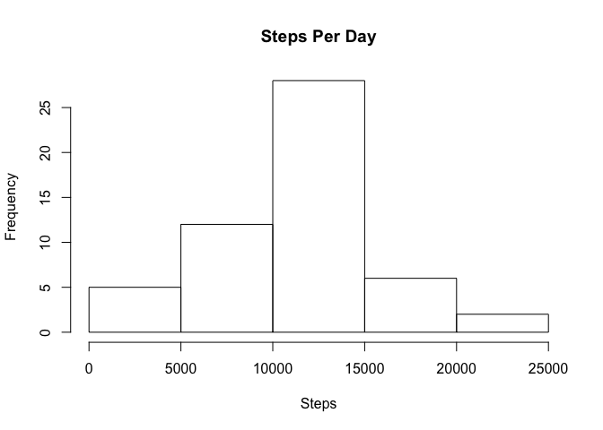
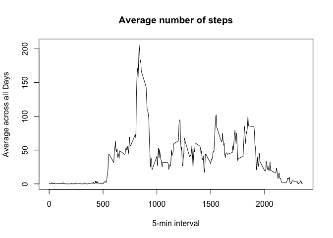

# Reproducible Research: Peer Assessment 1


## Loading and preprocessing the data

Data- 
This assignment makes use of data from a personal activity monitoring device. This device collects data at 5 minute intervals through out the day. The data consists of two months of data from an anonymous individual collected during the months of October and November, 2012 and include the number of steps taken in 5 minute intervals each day.

The activity.csv file has been downloaded to the Rep_Data_PeerAssessment1 directory which includes the RMarkdown, Markdown and Html files.

Read in the activity.csv file. 


```r
file <- "activity.csv"
df <- read.csv(file)

head(df)
```

```
##   steps       date interval
## 1    NA 2012-10-01        0
## 2    NA 2012-10-01        5
## 3    NA 2012-10-01       10
## 4    NA 2012-10-01       15
## 5    NA 2012-10-01       20
## 6    NA 2012-10-01       25
```

convert the date column from  factor to a Date


```r
class(df$date)
```

```
## [1] "factor"
```

```r
df$date <- as.Date(df$date)

class(df$date)
```

```
## [1] "Date"
```

## What is mean total number of steps taken per day?

Calculate the total number of steps taken per day


```r
d <- aggregate(steps ~ date,data = df,FUN=sum)
```

display histogram of steps per day

```r
hist(d$steps,xlab="Steps",main="Steps Per Day")
```



get and display the mean and median number of steps per day


```r
mean(d$steps)
```

```
## [1] 10766.19
```

```r
median(d$steps)
```

```
## [1] 10765
```
## What is the average daily activity pattern?

Calculate the average number of steps taken for each interval.

```r
di <- aggregate(steps ~ interval,data = df,FUN=mean)
```

display the plot 


```r
plot(di$interval, di$steps, type = "l", xlab = "5-min interval", 
    ylab = "Average across all Days", main = "Average number of steps", 
    )
```




determine which 5-minute interval, on average across all the days in the dataset, contains the maximum number of steps


```r
maxinterval <- di[di$steps==max(di$steps),]
maxinterval
```

```
##     interval    steps
## 104      835 206.1698
```
The maximum steps were taken in interval 835


## Imputing missing values

Calculate the number of NA's


```r
sum(is.na(df))
```

```
## [1] 2304
```
make a copy of the dataframe. In the new dataframe replace NA's with the mean number of steps for the interval.


```r
df2 <- df
for (i in 1:nrow(df2)) { 
    if(is.na(df2$steps[i])) { 
        df2$steps[i] <- mean(df2$steps[df2$interval==df2$interval[i]], na.rm=TRUE) } }
sum(is.na(df))
```

```
## [1] 2304
```

```r
sum(is.na(df2))
```

```
## [1] 0
```

Make a histogram of the total number of steps taken each day and Calculate and report the mean and median total number of steps taken per day.


```r
d2 <- aggregate(steps ~ date,data = df2,FUN=sum)

hist(d2$steps,xlab="Steps",main="Steps Per Day")
```


```r
mean(d2$steps)
```

```
## [1] 10766.19
```

```r
median(d2$steps)
```

```
## [1] 10766.19
```
The mean value for steps taken per day shows no difference and the median differs very very little and is now equal to the mean, when we replaced NA's with the mean value per interval.

## Are there differences in activity patterns between weekdays and weekends?

Create a new factor column which indicates if the date for a row is a weekday or a weekend day.


```r
wkdays <- weekdays(df2$date)
df2[,"dayofweek"] <- 0

for (i in 1:nrow(df2)) { 
  if (wkdays[i] == "Sunday" || wkdays[i] == "Saturday") 
    df2$dayofweek[i] <- "Weekend"
  else
    df2$dayofweek[i] <- "Weekday"
}
df2$dayofweek <- factor(df2$dayofweek)
 
class(df2$dayofweek)
```

```
## [1] "factor"
```

Create a dataframe with the average number of steps taken, averaged across all weekday days or weekend days per interval and then show a plot of this dataframe.


```r
library(lattice)
d3 <- aggregate(steps ~ interval + dayofweek,data = df2,FUN=mean)
xyplot(steps ~ interval | dayofweek, d3, type = "l", layout = c(1, 2), 
    xlab = "Interval", ylab = "Number of steps")
```


Activity on the weekends shows more spurts of high activity throughout the day while the weekday data has one major peak period with more contiguous periods of less activity. This corresponds to people being less active during working hours and very active before work.


